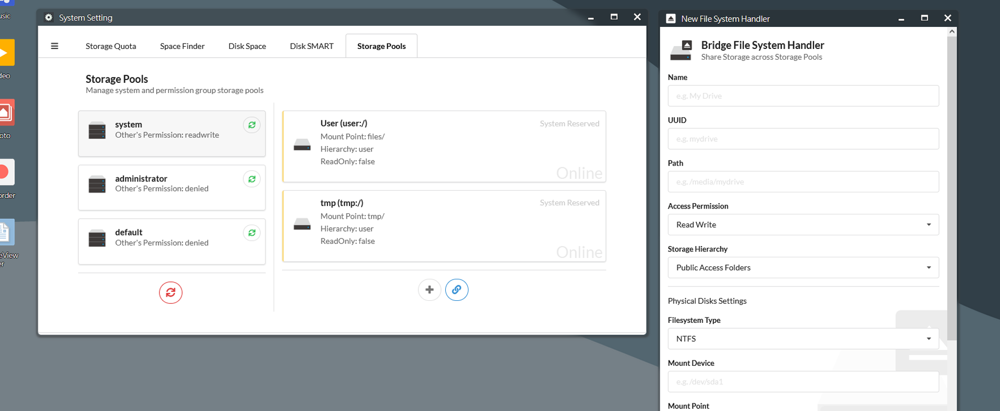

  

## IMPORTANT NOTES
The current arozos is still under intense development. System structure might change at any time. Please only develop on the current existing ArOZ Gateway Interface (AGI) JavaScript Interface or standard HTML webapps with ao_module.js endpoints.

## Features
### User Interface
- Web Desktop Interface (Better than Synology DSM)
- Ubuntu remix Windows style startup menu and task bars
- Clean and easy to use File Manager (Support drag drop, upload etc)
- Simplistic System Setting Menu
- No-bull-shit module naming scheme
### Networking 
- FTP Server
- WebDAV Server
- UPnP Port Forwarding
- Samba (Supported via 3rd party sub-services)
- WiFi Management (Support wpa_supplicant for Rpi or nmcli for Armbian)
### File / Disk Management
- Mount / Format Disk Utilities (support NTFS, EXT4 and more!)
- Virtual File System Architecture
- File Sharing (Similar to Google Drive)
- Basic File Operations with Real-time Progress (Copy / Cut / Paste / New File or Folder etc)

### Others

- Require as little as 512MB system memory and 8GB system storage
- Base on one of the most stable Linux distro - Debian
- Support for Desktop, Laptop (touchpad) and Mobile screen sizes


## Installation
Require GO 1.14 or above

Run the following the command to build the system

```
git clone https://github.com/tobychui/arozos
cd ./arozos/src/
go build
```
(Yes, it is that simple)

## Deploy
### For Raspberry Pi (For Raspberry Pi 4B+)
If you are using Raspberry Pi as your host, you can download one of the images and flash the image into your SD card. You will find a new network device named "ArozOS (ARxxx)" pop up in your "Network Neighbourhood". Double click the icon and you will be redirect to the system Web setup interface.

|Version|Download|Mirror|Remarks|
|---|---|---|---|
|arozos v1.110 (Stable)|https://wdfiles.ru/12d4e4|http://www.mediafire.com/file/r7l40jv727covej/arozos_v1.110.7z/file||
|arozos v1.109|https://wdfiles.ru/c5556b4473c75f6d|https://www.mediafire.com/file/mmjyv77ei9fwab5/arozos_v1.109.7z/file||
|arozos v1.108|https://wdfiles.ru/4053d3bfd730aa60|https://www.mediafire.com/file/aa8176setz3ljtv/arozos_v1.108.7z/file|WebDAV Support Added|
|arozos v1.107|https://wdfiles.ru/jv2x|https://www.mediafire.com/file/0ybduxs9db3j6ai/arozos_v1.107.7z/file|Samba Supported Added|
|arozos v1.106|https://wdfiles.ru/b49v|https://www.mediafire.com/file/ov58z14eo90b6g9/arozos_v1.106.7z/file||
|arozos v1.103|https://wdfiles.ru/b49b|https://www.mediafire.com/file/bw34ov9ugxefqjz/arozos_v1.103.7z/file||

*Yes, the download site is in Russia. No, I am not Russian, I use this site because they offer 80GB of storage for free*
**All the image listed above require 8GB or above microSD card**

To optain the .img file, you can unzip the compressed image using 7zip. If you don't have it, you can get it [here](https://www.7-zip.org/download.html)

### For other ARM SBC(e.g. Orange Pi / Banana Pi / Friendly ARM's Pis)
Download the correct architecture binary from the "release" tab and upload the binary with the "web" and "system" folder in "/src".
After upload, you should have the following file structure

```
$ ls
aroz_online_linux_arm64  web  system
```

Start the binary by calling ``` sudo ./aroz_online_linux_arm64 ``` (or without sudo if you prefer no hardware management)

### Windows
If you are deploying on Windows, you need to add ffmpeg to %PATH% environment variable.

This system can be built and run on Windows hosts with the following build instructions
```
# Download the whole repo as zip and cd into it
cd .\arozos\src\
go build
arozos.exe
```
**However, not all features are available for Windows**. 

## Docker
Thanks [Saren](https://github.com/Saren-Arterius) for creating this amazing DockerFile

See his repo over [here](https://github.com/Saren-Arterius/aroz-dockerize)

## Screenshots


## Start the ArozOS Platform

### Supported Startup Parameters
The following startup parameters are supported (As of 1.110)
```
  -allow_autologin
    	Allow RESTFUL login redirection that allow machines like billboards to login to the system on boot (default true)
  -allow_mdns
    	Enable MDNS service. Allow device to be scanned by nearby ArOZ Hosts (default true)
  -allow_pkg_install
    	Allow the system to install package using Advanced Package Tool (aka apt or apt-get) (default true)
  -allow_ssdp
    	Enable SSDP service, disable this if you do not want your device to be scanned by Windows's Network Neighborhood Page (default true)
  -allow_upnp
    	Enable uPNP service, recommended for host under NAT router
  -beta_scan
    	Allow compatibility to ArOZ Online Beta Clusters
  -cert string
    	TLS certificate file (.crt) (default "localhost.crt")
  -console
    	Enable the debugging console.
  -demo_mode
    	Run the system in demo mode. All directories and database are read only.
  -dir_list
    	Enable directory listing (default true)
  -disable_ip_resolver
    	Disable IP resolving if the system is running under reverse proxy environment
  -disable_subservice
    	Disable subservices completely
  -enable_homepage
    	Redirect not logged in users to home page instead of login interface
  -enable_hwman
    	Enable hardware management functions in system (default true)
  -hostname string
    	Default name for this host (default "My ArOZ")
  -iobuf int
    	Amount of buffer memory for IO operations (default 1024)
  -key string
    	TLS key file (.key) (default "localhost.key")
  -max_upload_size int
    	Maxmium upload size in MB. Must not exceed the available ram on your system (default 8192)
  -ntt int
    	Nightly tasks execution time. Default 3 = 3 am in the morning (default 3)
  -port int
    	Listening port (default 8080)
  -public_reg
    	Enable public register interface for account creation
  -root string
    	User root directories (default "./files/")
  -session_key string
    	Session key, must be 16, 24 or 32 bytes long (AES-128, AES-192 or AES-256). Leave empty for auto generated.
  -storage_config string
    	File location of the storage config file (default "./system/storage.json")
  -tls
    	Enable TLS on HTTP serving
  -tmp string
    	Temporary storage, can be access via tmp:/. A tmp/ folder will be created in this path. Recommend fast storage devices like SSD (default "./")
  -tmp_time int
    	Time before tmp file will be deleted in seconds. Default 86400 seconds = 24 hours (default 86400)
  -upload_async
    	Enable file upload buffering to run in async mode (Faster upload, require RAM >= 8GB)
  -upload_buf int
    	Upload buffer memory in MB. Any file larger than this size will be buffered to disk (slower). (default 25)
  -uuid string
    	System UUID for clustering and distributed computing. Only need to config once for first time startup. Leave empty for auto generation.
  -version
    	Show system build version
  -wlan_interface_name string
    	The default wireless interface for connecting to an AP (default "wlan0")
  -wpa_supplicant_config string
    	Path for the wpa_supplicant config (default "/etc/wpa_supplicant/wpa_supplicant.conf")
```

Example
```
//Starting aroz online with standard web port
./aroz_online -port 80

//Start aroz online in demo mode
./aroz_online -demo_mode=true

//Use https instead of http 
./aroz_online -tls=true -key mykey.key -cert mycert.crt

//Change max upload size to 25MB
./aroz_online -max_upload_size 25

```

### Storage Configuration
#### Deploying Single Machine

If you are deploying single machine, you can visit System Setting > Disk & Storage > Storage Pools and edit the "system" storage pool for setting up the global storage pools for all users in the system.




#### Deploying on Multiple Machines

If you are deploying on multiple machines, you can take a look at the storage configuration file located in:

```
src/system/storage.json.example
```

Rename the storage.json.example to storage.json and start arozos. The required virtual storage drives will be mounted accordingly.


## ArOZ JavaScript Gateway Interface / Plugin Loader
The ArOZ AJGI / AGI interface provide a javascript programmable interface for ArOZ Online users to create 
plugin for the system. To initiate the module, you can place a "init.agi" file in the web directory of the module
(also named the module root). See more details in the .

## Community / Q&A
Find us on [Telegram](https://t.me/ArOZBeta)! We welcome all kind of feedbacks and questions.

Already using ArozOS? Show us your server configuration!

https://github.com/tobychui/arozos/issues/50

## License

CopyRight tobychui 2016 - 2021

No limit for personal and educational usage. For other use case, please contact me via email or telegram.

## Buy me a coffee
I am working on this project as a hobby / side project and I am not really into collecting donation from this project. 
