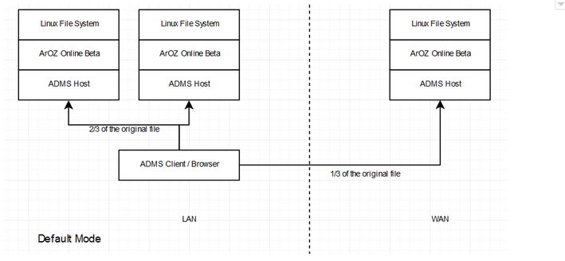
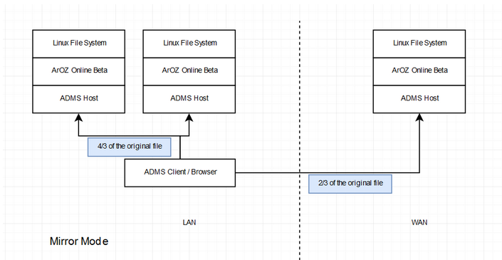

["7. ArOZ Data Chunking System (Deprecated)"]

# ArOZ Data Chunking System (Deprecated)

ADCS is an emulated file system used across multiple domains and Local Area Network. This system is designed to be portable and robust in extreme conditions, with support over upward compatibility and speed with old generation hardware.

The software is mainly written in PHP with the latest HTML5 / JavaScript to enable web based download on modern browsers. It is based on the ArOZ Online and requires SystemAOB functional libraries to perform normal operations.

#### System Mechanism

ADCS systems should contain at least one Host System with at least two storage partitions. The recommended configuration will be with two or more Host System with each Host System one storage partition in SATA or multiple storage partition with USB interface. The best configuration can be calculated with the following formula

#### **Maximum Speed**

\# of Storage Device = Ethernet Speed / min( Disk IO Speed, Interface Speed)

#### **Maximum Storage**

\# of Storage Device = # of USB Port + # of SATA Port

During upload, files are split into a number of 4MB chunks of file and uploaded to ADCS host with Round Robin Algorithm within the same LAN (default) or chosen from a list of predefined host list stored on the host system and mirrored from and within the LAN. File will be splitted and stored on multiple servers, or duplicate over multiple servers if the preset is set to Mirror (2 copies of each Chunk), Kaleido (3 copies of each chunk). 

*Under Mirror Mode, each chunk has two copies on different nodes.

And during download, the Client / Browser (with ADCS JavaScript based Web Interface) , the client will access one of the file index mirrors on a random node for getting all the UID of ArOZ Online related in a particular file. The index file will indicate the main archive and backup archive for each data chunk (if uploaded with Mirror or Kaleido mode), and perform a quick check to see if that particular host exists. The download target will switch from main to backup if a particular host is not found. After all the hosts listed in the index are found, the download will start with a multi-threaded method (client only) or file stream (browser only).

### Full System Structure

The system is designed with low cost hardware or old generations PC which has lower processing power and Ethernet connection speed. In which, in this system, by making use of parallel computing and storage workflow, it is possible to increase the speed of the system by deploying a new load balanced instance. 

The full system diagram is shown below. The clusters and client were separated with a dotted line. Both Cluster and Client are expandable if required.

**Remarks**

This system is still under design and implementation of ADCS on ArOZ Online is very basic. It is not recommended to use this system across the internet as the authentication mechanism is still a work in progress.