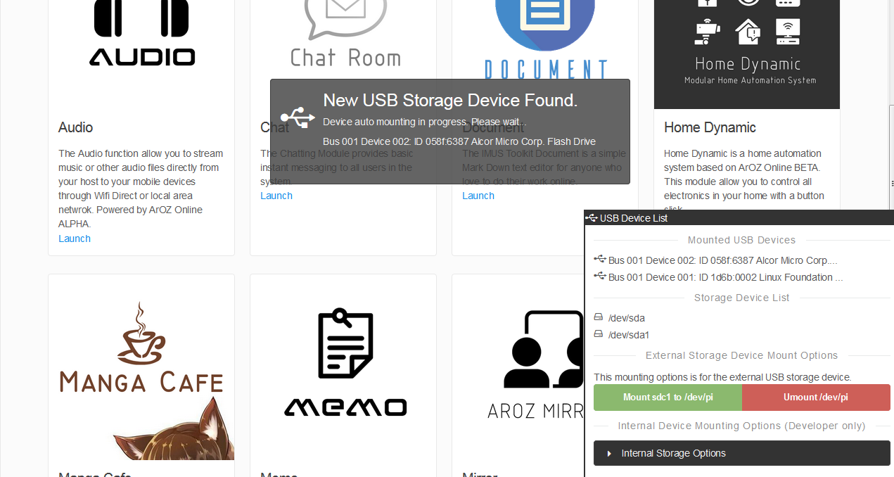

["4.6 System Functions via VDI"]
# System Functions via VDI
VDI provides many system functions for quick access through the function bar for the ease of 
system control on a desktop environment.

## Virtual File Explorer (VFE)
The Virtual File Explorer bridge the gap between web application and real operating system.
The AOB VFE can perform all the task an OS provides with a web based interface. Including file move
, delete, copy, cut,rename and paste. The VFE also support new folder, download and upload.

By double click on any files, VFE will try to open the file in a new window if the file type is
supported. If the user double click on directory, the file list will be updated to list all the
files inside the selected directory.

To exit a directory, simpily click the back button or click the first item in the directory list
for exiting the current directory and back to its parent directory.

Read the VFE page for more information.

## System Power
The System Power menu provide the basic functions for shutting down the server or host devices using 
php and python script. This function can be disabled by removing the python script.  
The Power Menu was shown in the bottom left hand corner of the picture below:

## USB Mount
On the bottom right hand corner of the image above, the system has build in a USB Mounting short cut
for linux system users. The ArOZ Portable has a default design of two internal storage via USB2.0 on
the raspberry pi zero w using a USB hub. Here are the list of the default mounting points:

- /media/storage1 (Internal Storage 1, USB2.0 64GB)
- /media/storage2 (Internal Storage 2, USB2.0 64GB)
- /media/pi (Exteranl Storage, USB Devices)

The USB Mounting script togther with the function bar system will show an alert on new USB device 
found when a user insert a USB drive into the host device as shown in the image below:

<mark>Parts of the function group might not works on Windows System</mark>

## My Host
My Host shows the statistic of the host devices. Including the hardware specification,
storage situation, network card status and USB devices found. This function has slightly
difference on Windos Devices. 

<mark>On Window Host, the PHP script with bash command is replaced with .NET based binary exe files.
If you encounter data read error or no information is shown, please check if the exe files has permission to run.</mark>
