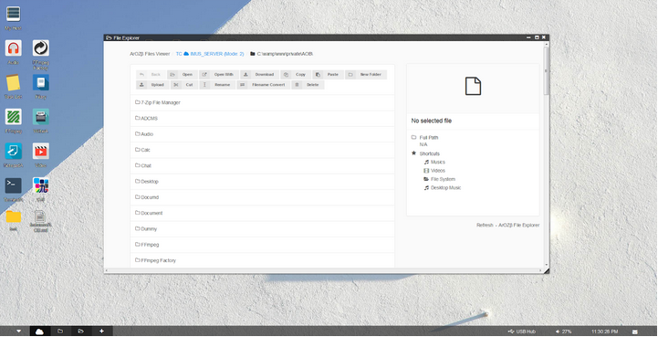
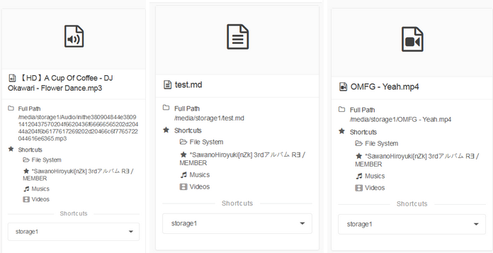
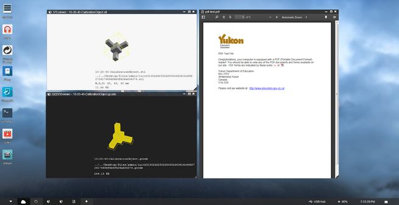
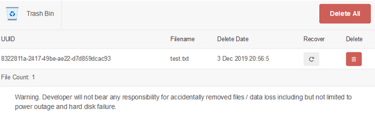
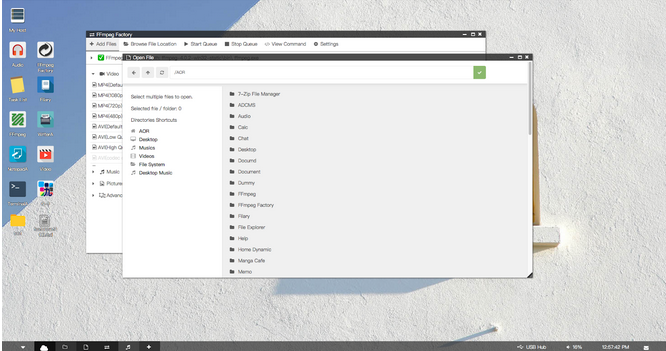
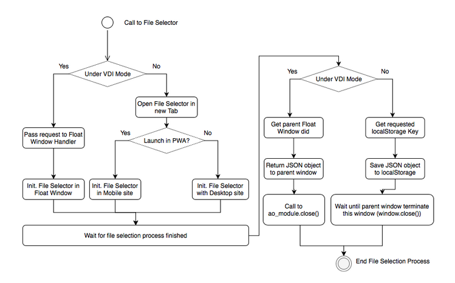

["6. ArOZ File System"]

# ArOZ File System

ArOZ Online provides a cloud file system bridge for users to access files in some specified directories. In most of the time, users (even admin) can only access files within ArOZ Online Root (AOR, which auth.php and root.inf located) and /media/* (Linux only. On windows, there is no default enabled external storage directory.)

This is a standard ArOZ File System - File Explorer under Window Host Environment



Under Linux Environment with External Storage mounted to /media/storage*, an extra list on the right function bar will appear and allow users to navigate to external storage devices


***Under Windows Host Environment, users can use “disk management tool” in Windows’ system utilities to mount an entire hard disk into a directory inside the web root. Hence, this function is not provided in the ArOZ Online System.***


Files stored with different filename encoding methods are displayed with different color schemes. In simple words, here is a list descripting the color scheme used by the file explorer.


| Green | Hex-encoded folder name                      | Display prefix: *                     |
| ----- | -------------------------------------------- | ------------------------------------- |
| Blue  | UM-Filename encoding method                  | Filename start with “inith” + hexcode |
| White | Filename stored with System Default encoding |                                       |


The side bar contains information about the file user selected. The content changes when the user clicks on a file. Here are some examples of files that the sidebar can display.





ArOZ File System stores files with filename in hex format. The naming method is called UM_Filename Encoding (Stand for Unified Multi-language Filename Encoding). It is encoded with “inith” + (filename in utf-8 bin2hex format). This is used for handling utf-8 filename on non-unicode operating systems. For example, Japanese filename on Big-5 based Windows will be encoded to um-filename when uploaded to the ArOZ File System.


See Appendix for a list of scripts that are used in ArOZ File System Bridge.

ArOZ File Explorer also acts as a file opener if the correct parameter is passed into the URL. For more information, please reference the API chapters on how to launch a file via File Explorer API. 

These scripts that made up the ArOZ File System provide the fundamentals for the distributed data storage system which is built on top of ArOZ File System.


### File Extension Default Opener

Here is an example for the csv files located inside the “default” directory of file_system. It is a piece of information that allows file explorers to read and open the given file with suitable webapp. Each csv file only contains 1 line. Take mp3.csv as an example.

`Audio,embedded,music,640,170,0,1`


The format for the csv is as follows.

`{Module_Name},{Open_method}, {icon}, {window_width},{window_height},{resizable},{resizable},{Glass-Effect}`


### File / Folder Open API

Any modules with correct permissions can request ArOZ File Explorer to open a folder or files with RESTful API. Here are some examples for opening a file and folder using the API.

##### Open File:

`AOR/SystemAOB/functions/file_system/index.php?controlLv=2&mode=file&dir={filepath}&filename={display_filename}`

##### Open Folder:

`AOR/SystemAOB/functions/file_system/index.php?controlLv=2&subdir={directory_to_be_opened}`

Developers that use this API need not to care about the current state of display mode (Either default, mobile or VDI). The file explorer API will handle the rest of the launching process.


### Custom File Extension Opener

Some files with certain extensions require special means to open them as they are not supported by any module yet. Some built- in file extension openers are included in SystemAOB ,for example pdf, stl and gcode files. Those files did not require any external module to support the opening file function calls.



(Example of stl file viewer (top left), gcode viewer (bottom left) and pdf viewer (right) )


### File Recycling Mechanism

For all files deleted in the File Explorer, the files will be automatically moved to the “Trash bin” located inside the user root folder located in DDCF with user isolation rules enforced. 

In most cases, the deleted files or folders will be moved to *C:\AOB\users\{username}\SystemAOB\functions\file_system\trash* (Window host) or */etc/AOB\users\{username}\SystemAOB\functions\file_system\trash* (Linux host).

The deleted file will be given a UUID and stored inside two separate folders: data/ and regi/, which holds the data byte itself and delete information like original path, file name and delete timestamp.

The deleted files can be found and recovered from the trash bin using the trashBin.php interface provided with the file system. The following is an example deleted file.



### File Selector API

ArOZ File System also provides an API for modules to access file selector via AJAX calls. The file selector relies on a cross frame pipeline while running under Virtual Desktop Mode or localStorage when running under barebone mode. 

Here is a demo of FFmpeg Factory calling File Selector with File Selector API under Virtual Desktop Mode





The File Selection Process is as follows.




File selection API can also be used to create new files. The following new parameters are required for the file selector to provide a GUI for the user to create a file.

`selectMode=newuseUMF=(true / false)newfn=(default filename)`

Noted: The file selection API will not create a file after confirmation. It only provides the path in which the user selected with the filename to the API callee. 


File selector in file creation mode with default filename “mymodel.gcode”

### Asynchronize File Operation

The file system copy / cut and paste function is performed by a background program called “fsexec”. It is a golang written file operation manager that perform copy cut or pasting of files between directories or external storage devices. When the request for file operation is received, the fsexec.php, which is a wrapper for the “fsexec” and “fszip” function, will send the command to the corresponding pre-compiled binary for file operation. The real time output will be logged to the log/ folder. There are two subdirectories under the log/ folder. The log file will be moved to the corresponding location during or after the file operations.


| File Operation in progress | Log file under ./log/*.log         |
| -------------------------- | ---------------------------------- |
| File Operation Succeed     | Log file move to ./log/done/*.log  |
| File Operation Failed      | Log file move to ./log/error/*.log |

Where the * is the uuid of the file operation.

### Global Clipboard

The global clipboard can be enabled in the System Preference setting for the file explorer to temporarily store target file path in browser’s local storage and being pasted by another instance of file explorer within the same domain namespace. 

### Recursive Filename Conversion for other File System

The fsconv is a golang written, pre-compiled binary for converting files, folders or recursive file and folder to and from um-filename method and standard file naming method used in other file systems. The binary itself can also be used for quick conversion of all files and folders under the application startup path from um-filename to normal filename by double clicking (No parameter needed). Other modes of fsconv are also supported in the command line interface.

Usage of fsconv.exe: -i string    Input filename. -r  Enable recursive filename translation. -rd    Recursive rename directory only. -rf    Recursive rename file only. -um    Convert to UMfilename format -utf    Convert to standard UTF-8 filename format 

```
Usage of fsconv.exe:

 -i string

​    Input filename.

 -r  Enable recursive filename translation.

 -rd

​    Recursive rename directory only.

 -rf

​    Recursive rename file only.

 -um

​    Convert to UMfilename format

 -utf

​    Convert to standard UTF-8 filename format
```

For Windows users, a GUI tool can be used called the ArUSB2Win which builds on the fsconv binary. See https://github.com/tobychui/ArUSB2Win for more information.


