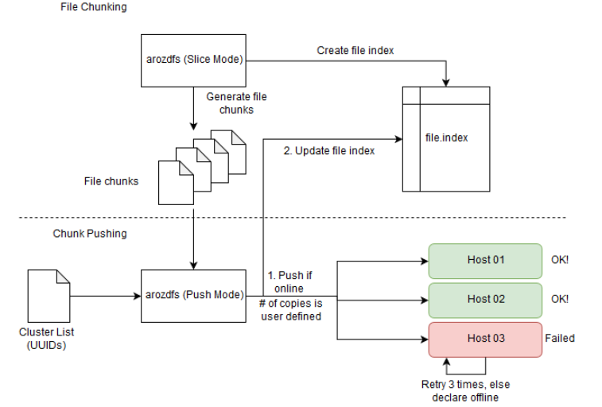
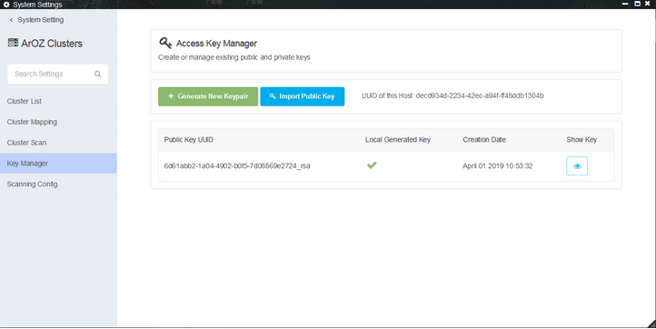
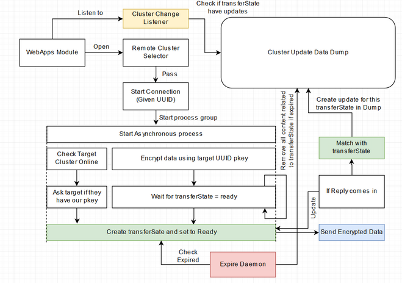

["8. ArOZ-DFS"]

# ArOZ-DFS

ArOZ DFS (or arozdfs service) is a subsystem created to replace the ADCS. “arozdfs” is written in golang for high performance and speed splitting of large data files. Compared to ADCS, it allows real time resolution of UUID to IP address using the cluster services. The system is designed as follows.

The arozdfs (binary) file inside SystemAOB is the core of the slicing, upload, download and merging (open) process. The binary file supports these operations and allows the backend system of ArOZ Online to perform background slicing while not freezing the main thread that handles incoming requests. The upload and download process is shown below.

### Arozdfs Upload

Given a large file (in this example, a 256MB file is used). It will be sliced according to a predefined size (Default: 64MB). The system will perform two pass uploading with the cluster list shifted by x units (which is also defined by the user). This will create redundant chunks for each file chunk and prevent data corruption due to disk failure. External Disk Access Services is also used to allow users storing the data chunks in external storage devices.

### Arozdfs Download

Arozdfs download will require an intake of an index file. For each file chunk uuid and its corresponding network endpoints uuid in the file, the system will first resolve the uuid to the current IP address of the endpoints. Next, the system will request each endpoint for a corresponding file chunk uuid. After downloading all chunks, the chunks will be merged in the background to form the original file.

## # Clustering and Cross Host Messaging Pipeline

ArOZ Online System provides in-system clustering and job distribution system by default. 

The clustering system relies on RSA encrypted messages that request between hosts to perform collaborative task processing and file exchange. In this section, the clustering functions are descriptive with the following items.

### Establish Cluster Relationship

All ArOZ Systems are by default visible by all other clients and hosts. However, it is not possible to communicate with it without going through the setup process. In the setup process, the user has to manually visit the host setup page and copy & paste the generated public key to another host. This is to ensure the connections are established by hand and not be any automated scripts. Here is a simple visualization of that process.

This design prevents the automatic authentication and generation of private and public keys by remote unauthorized users. Furthermore, this design reduced the chances of having a weak spot in system security.

The public and private key pairs can be generated via System Settings > Cluster > Key Manager. The user need not have advanced knowledge in security in order to handle the cross cluster communication setup process.

#### Cluster Communication Pipeline

Cluster Communicate between nodes using end to end encryption. The process follows the scenario mentioned in the diagram below.

Lines in purple are those data sent encrypted. Host A is the request initializer and Host B is the request receiver. Assume the setup has been done in Host A and Host B in which the communication is established with a given set of private key and public key.

System Implementation of the Cluster Communication Pipeline will be as follows.

#### Keygen Mechanism and Key Storage File Tree

Private and public key pairs can be generated with in-system scripts and stored in ADDC Directory (Please refer to section: ArOZ Device Dependent Configuration Folder). For all local generated key pairs, they will be stored under ADDC/keypairs/ as {uuid-v4}_rsa (private key) and {uuid-v4}_rsa.pub (public key). These are the keys that are used by other machines to send files to the current host. While other public keys that used to send data to other host / cluster groups, it is stored in ADDC/keypairs/remote/ with {remote_device_uuid}_rsa.pub filename.