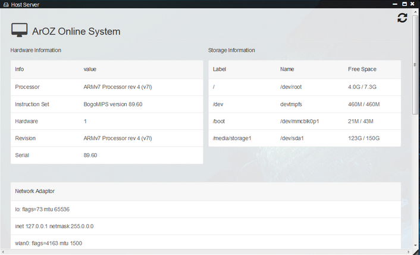
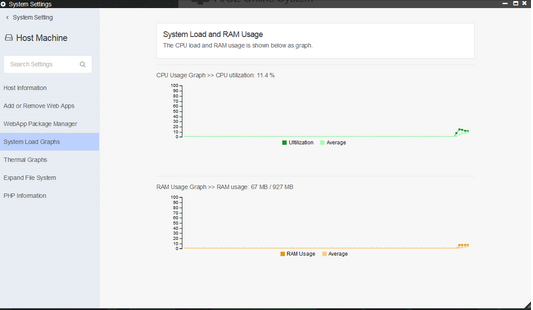
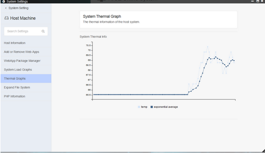
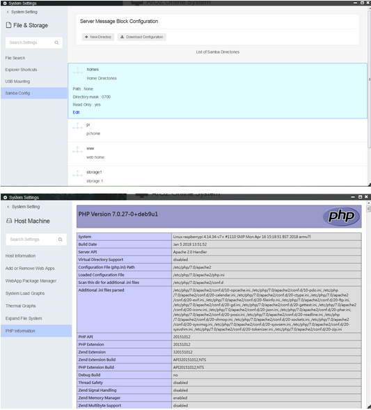

["5. System Setting and Hardware Management Tools"]

# System Settings and Hardware Management Tools

System Settings Module contains all the important settings of the ArOZ Online Cloud System which includes Host Hardware Management Tools, Network Discovery Tools like WiFi setup, Samba setup etc, and personalization settings.

This system can run on different hardware as soon as a debian like system is supported. Here is an example of ArOZ Online System running on Raspberry Pi 3B+ (ARM SoC based SBC)

ArOZ Online System can also show PHP Information and Samba configuration. It also provides you the ability to adjust the Host Settings while it is running. (Some adjustment or setting changes might require restart)

