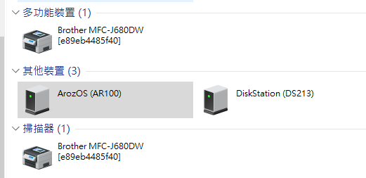
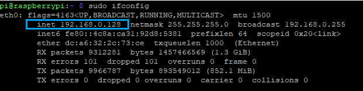
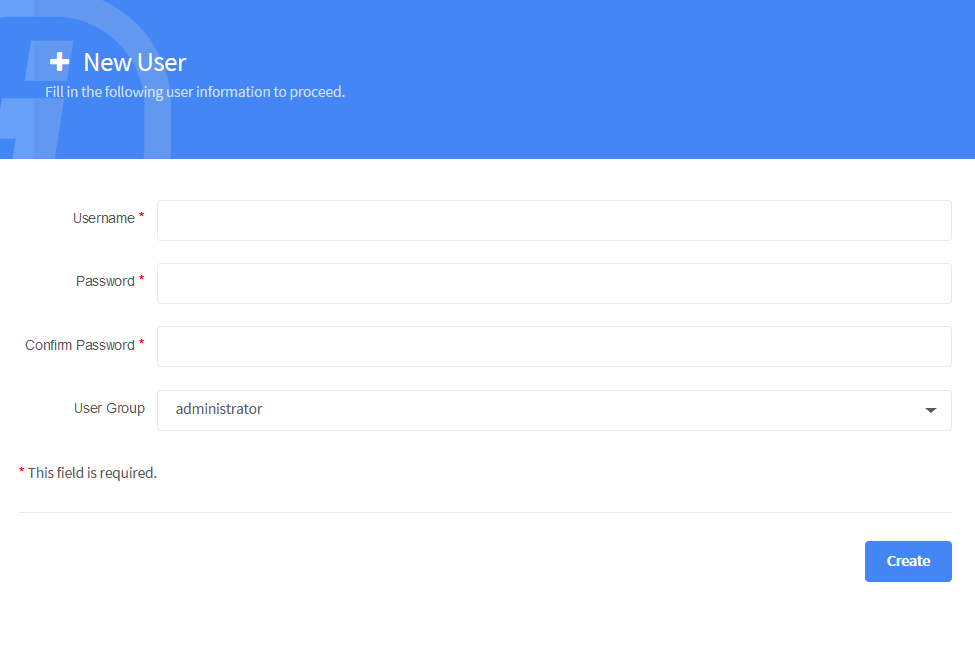
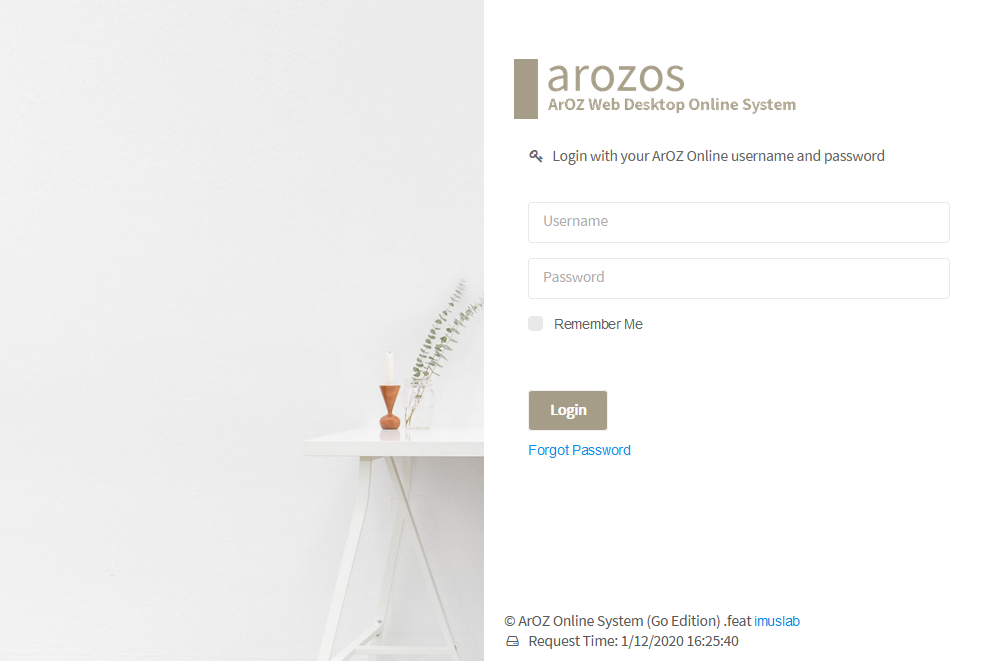

["First Time Startup"]

# First Time Startup

If you are starting up your system for the first  time, you will see the following message shown in the console showcasing your setup is complete and it is now working. The following is an example from v0.1.109 release on Windows Hosts

```
2021/01/06 12:58:31 ArozOS(C) 2020 IMUSLAB.INC.
2021/01/06 12:58:31 ArozOS development Revision 0.1.109
2021/01/06 12:58:31 Key-value Database Service Started: system/ao.db
2021/01/06 12:58:31 New authentication session key generated
2021/01/06 12:58:31 Key-value Database Service Started: files/aofs.db
2021/01/06 12:58:32 Key-value Database Service Started: tmp/aofs.db
2021/01/06 12:58:32 Failed to create system handler for Storage 1
2021/01/06 12:58:32 Unsupported platform
2021/01/06 12:58:32 Failed to create system handler for Storage 2
2021/01/06 12:58:32 Unsupported platform
2021/01/06 12:58:32 Failed to create system handler for Storage 3
2021/01/06 12:58:32 Mount point not exists!
2021/01/06 12:58:32 Failed to create system handler for Storage 4
2021/01/06 12:58:32 Mount point not exists!
2021/01/06 12:58:32 Key-value Database Service Started: web/aofs.db
2021/01/06 12:58:32 Web Mounted as web:/ for group administrator
2021/01/06 12:58:32 Failed to create system handler for Test
2021/01/06 12:58:32 Mount point not exists!
2021/01/06 12:58:33 ArozOS Neighbour Scanning Started
2021/01/06 12:58:33 Web server listening at :8080
```

**For first time startup, we recommend running the program using sudo permission for it to install all dependencies that it needs using apt-get**

Once you see the console stop printing new text, you can now create your first account on your ArozOS Host.

## Connecting to the Web UI

### Windows Network Neighborhood Method

If you are using Windows as your main system, you will see the following  devices pop up on your Network Neighborhood page. 




Double click the icon and you will be redirected to the ArozOZ Web UI Home page.


### Router IP Checking

In the case you don't know the IP address of your host, check the IP address of your host from your NAT gateway router. It is usually under DHCP --> Client List --> Your host name & the LAN IP Address.


### SSH IP Checking

If you have already connected to your host using SSH, use ```sudo ifconfig``` to see what IP address it is using. In most case, you will find your address under eth0 . In the example below, it is 192.168.0.128.




## Setting up the first user account

After you have redirected to the Web UI, create your account with new username and password. Select "Administrator" under the user group option and continue.




## Login with your new username and password

After your account is created, you can now login to your system using your username and password just entered. Be reminded that this a standalone system that there is no way to recover your password using email / phone SMS services like the other cloud services. So **DONT FORGET YOUR ADMINISTARTOR PASSWORD**

