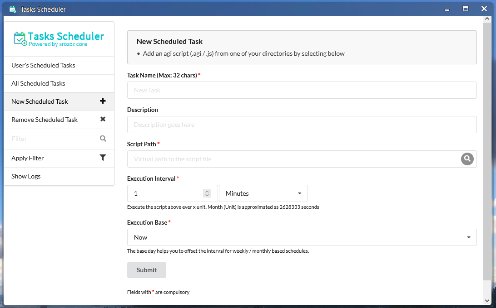

# WebApp Developer Guide

## ArOZ Gateway Interface (AGI)

This folder holds all the examples for the Aroz Gateway Interface (AGI) API calls. An AGI API call can be executed in following ways. A The AGI scripts have slightly different functions in different execution scopes. The role of the execution is listed in the brackets below.

1. Execute as WebApp initialization script (system)
2. Execute as WebApp backend (system)
3. Executes as user script via "Serverless" tool (current user)
4. Execute as scheduled service via "System Scheduler" (current user)


### Introduction

The AGI API provide most of the basic functions that you will need for programming your own WebApp. AGI implements a JavaScript like interface that works like PHP with Apache where you can pass in GET / POST parameter, calculate the results in backend and return the results to front-end. 

### Usage

In the WebApp examples below, we will be discussing a self written module with the following basic structure.

```
└── web/
    └── mywebapp/
        ├── init.agi
        ├── index.html
        ├── embedded.html
        ├── floatwindow.html
        ├── img/
        │   ├── icon.png
        │   └── desktop_icon.png
        └── backend/
            └── logic.js
```

### As WebApp Initialization Script

Your WebApp will not be loaded by ArozOS unless an init.agi file is found at its root. Here is an example of the most basic ```init.agi``` script

```javascript
//Define the launchInfo for the module
var moduleLaunchInfo = {
    Name: "MyWebApp",
	Group: "Media",
	IconPath: "mywebapp/img/small_icon.png",
	Version: "0.1",
	StartDir: "Dummy/index.html"
}

//Other startup logics here

//Register the module
registerModule(JSON.stringify(moduleLaunchInfo));
```

This is the full version of module launch info with all settings

```json
{
    Name: "Music",
	Desc: "The best music player in ArOZ Online",
	Group: "Media",
	IconPath: "Music/img/module_icon.png",
	Version: "0.1.0",
	StartDir: "Music/index.html",
	SupportFW: true,
	LaunchFWDir: "Music/index.html",
	SupportEmb: true,
	LaunchEmb: "Music/embedded.html",
	InitFWSize: [475, 720],
	InitEmbSize: [360, 254],
	SupportedExt: [".mp3",".flac",".wav",".ogg",".aac",".webm",".mp4"]
}
```

Here are the meaning of all the fields

| Field Key    | Usage                                                        | Data Type (Length) | Example                                              |
| ------------ | ------------------------------------------------------------ | ------------------ | ---------------------------------------------------- |
| Name         | Name of the WebApp                                           | String             | Music                                                |
| Desc         | Description of the WebApp                                    | String             | Just another music player                            |
| Group        | Catergory of the WebApp                                      | String             | Media                                                |
| IconPath     | Path to find the module icon (and desktop icon)              | String             | Music/img/module_icon.png                            |
| Version      | Version number of the WebApp                                 | String             | 0.1.0                                                |
| StartDir     | Entry point of the webapp                                    | String             | Music/index.html                                     |
| SupportFW    | If the WebApp support floating windows                       | Boolean            | true                                                 |
| LaunchFWDir  | If Float Window mode is supported, the entry point when the user is launching the app in Float Window mode | String             | Music/index.html                                     |
| SupportEmb   | If the WebApp support opening a file                         | Boolean            | true                                                 |
| LaunchEmb    | If a user use this WebApp to open a file, which entry point the user shall be directed to | String             | Music/embedded.html                                  |
| InitFWSize   | The prefered size of floating window                         | Integer Array (2)  | [475, 720]                                           |
| InitEmbSize  | The preferred size for embedded file player                  | Integer Array (2)  | [360, 254]                                           |
| SupportedExt | The extension that is supported by this webapp as default file opener | String Array       | [".mp3",".flac",".wav",".ogg",".aac",".webm",".mp4"] |

#### WebApp Group

There are a few preset WebApp groups that the desktop can load. 

- Media
- Office
- Download
- Files
- Internet
- System Settings
- System Tools

Other groups strings will be listed in "Others" in the desktop start menu.

Here are some reserved groups for special purposes. Use them only when you are handling development of special use cases.

- Utilities 
  (This type of webapps will ignore user permission systems and allow all user to access it. **It is use for HTML front-end side only webapps.** )
- Interface Module
  (This is a special type of WebApp that allow a permission group to start it up full screen. For example, the "Desktop" is a Interface Module)

#### File Open Only WebApps

If you are writing an WebApp that do not provide browsing interface but only file opener (Your app cannot be used when the user is not opening a file, for example a PDF viewer), you can set "StartDir" as empty string. This will force Desktop not to render it into the start menu.


### As WebApp Backend

Place your .js or .agi files in your webapp root folder (e.g. ```./web/mywebapp/backend/logic.js```), then in your webapp index file (e.g. ```./web/mywebapp/index.html```), call to the script using ao_module wrapper library. Here is an example of its usage

index.html

```html
<html>
    <head>
        <!-- Include the ao_module wrapper -->
        <script src="../script/ao_module.js"></script>
    </head>
    <body>
        <!-- Your HTML code here -->
        <script>
            function runLogic(){
    			ao_module_agirun("mywebapp/backend/logic.js", 
                {name: "Aroz"}, 
                function(resp){
                    	alert("Resp: " + resp);
                }, 
                function(){
                    alert("Oops. Something went wrong")
                }, 30)
            }
        </script>
    </body>
</html>
```

logic.js

```
SendResp("Hello " + name + "! Nice to meet you!");
```

The function definition is as follows.

```javascript
function ao_module_agirun(scriptpath, data, callback, failedcallback = undefined, timeout=0)
```

**For more examples, see the ```agi_examples``` folder.**

### AGI Serverless

AGI scripts can also be used as serverless script to do simple things like updating server side files or webhook. Assgin the "Serverless" WebApp to a restricted user group and add your .js or .agi script to the serverless app. The app will generate an API endpoint for you for external access. Click on the "Copy" text to get the link to the access endpoint.


### AGI in System Scheduler 

If you want to schedule the task to run in a fixed interval, you can use the AGI script in system scheduler. Assign the "Task Scheduler" WebApp to a restricted user and add the target script into the scheduler. The scheduler will than execute your script on the set interval. 

*Note that you should test your script with Serverless before putting it into Scheduler as it is much more difficult to debug when a task is added into the scheduler.*





## Floating Windows API

When your app is launched using float window systems on ArozOS desktop, you can adjust the current windows of your WebApp with some of the following APIs included in the ao_module.js wrapper. You can find the wrapper library that ship with ArozOS in each version in ```./web/script/ao_module.js```.

To include it, add this into your html head section

```html
<script src="../script/ao_module.js"></script>

//DO NOT DO THIS!!!!
<script src="/script/ao_module.js"></script>
```

As the relative path is critical for the script to finds it relative location to system root, **DO NOT USE ABSOLUTE PATH IN THE INCLUDE SCRIPT**

### Float Window Control Functions

These functions are in global scope with your JavaScript. These are use to interact with the desktop interface for perform dynamic float window properties change. here are some functions by categories

| Function Name                             | Usage                                                        | Example                                            |
| ----------------------------------------- | ------------------------------------------------------------ | -------------------------------------------------- |
| ao_module_setFixedWindowSize()            | Set the float window to non-resizable                        |                                                    |
| ao_module_setResizableWindowSize()        | Set the float window to be resizable                         |                                                    |
| ao_module_setWindowSize(width, height)    | Change the size of the float window                          | ao_module_setWindowSize(480, 240)                  |
| ao_module_setWindowTitle(newTitle)        | Update the title of the float window                         | ao_module_setWindowTitle("Loading File")           |
| ao_module_makeSingleInstance()            | Load the current path into another instance's windows if exists |                                                    |
| ao_module_getInstanceByPath(matchingPath) | Get other float window instance that have the same starting path | ao_module_getInstanceByPath("NotepadA/index.html") |
| ao_module_close()                         | Close this float window                                      |                                                    |
| ao_module_focus()                         | Focus this float window and move to top                      |                                                    |
| ao_module_setTopMost()                    | Fix this float window top most                               |                                                    |
| ao_module_unsetTopMost()                  | Unfix this float window from top most                        |                                                    |

### Creating New Float Window in WebApp

You can call to the ```ao_module_newfw``` function to start another float window object. Here is a basic usage of such function call

```javascript
ao_module_newfw({
    url: "Dummy/index.html",
    title: "Dummy Module",
    appicon: "Dummy/img/icon.png"
});
```

Here is another example involving all possible paramters.

```javascript
ao_module_newfw({
    url: "Dummy/index.html",
    uid: "CustomUUID",
    width: 1024,
    height: 768,
    appicon: "Dummy/img/icon.png",
    title: "Dummy Module",
    left: 100,
    top: 100,
    parent: ao_module_windowID,
    callback: "childCallbackHandler"
});
```

### Handling Embedded Mode Input File / File Open

You can check if ArozOS File Manager is passing in any file for you to open using ```ao_module_loadInputFiles``` function. This function will return null if there are no files being passed in or return an array if there are any.

Here is an example to get and load the files.

```javascript
var inputFiles = ao_module_loadInputFiles();
if (inputFiles != null){
	inputFiles.forEach(function(f){
		console.log(f.filename, f.filepath);
	});
}
```


### Parent and Callback

If your current float window is started by another float window that has set parent object ID and callback, you can send data back to the parent float window which started the current window. 

To check if the current float Window have a parent object, use ```ao_module_hasParentCallback()``` which will return a boolean. Then, you can call to ```ao_module_parentCallback(data)``` to send data back to parent.  Here is an example of such callback.

```javascript
let callbackData = {payload: "Hello World!"};
if (ao_module_hasParentCallback()){
	ao_module_parentCallback(JSON.stringify(callbackData));
    ao_module_close();
}else{
	alert("Parent no longer exists")
}
```

### Upload File

To upload file, you can use the basic API included in the ao_module wrapper.

```javascript
function ao_module_uploadFile(file, targetPath, callback=undefined, progressCallback=undefined, failedcallback=undefined)
```

However, if the upload is large or involve complex checking logic, please use RESTFUL API provided by File Manager for detailer flow controls. 

### File Utilities Functions

#### Open File Selector

```ao_module_openFileSelector``` allow user to pick a file from the current ArozOS Host. The function definition is as follows.

```function ao_module_openFileSelector(callback,root="user:/", type="file",allowMultiple=false, options=undefined)```

Here is a basic example of starting a file selector from a WebApp.

```javascript
ao_module_openFileSelector(fileSelected, "user:/Desktop", "file", true);

 function fileSelected(filedata){
        for (var i=0; i < filedata.length; i++){
            var filename = filedata[i].filename;
            var filepath = filedata[i].filepath;
            //Do something here
        }
    }
```

 Possible selection type: {file / folder / all / new}

| file   | File Only                 |
| ------ | ------------------------- |
| folder | Folder Only               |
| all    | Anything (File or Folder) |
| new    | Create new file           |

#### Open Server File path

```ao_module_openPath``` allows you to open a folder and redirect a user to a given file. The function definition is as follows.

```javascript
function ao_module_openPath(path, filename=undefined)
```

Here is an example

```javascript
ao_module_openPath("user:/Desktop", "music.mp3")
```

This will start a File Manager instance and open user:/Desktop. After the folder is loaded, music.mp3 will be highlighted.

#### Open Local File Path

```ao_module_selectFiles``` allows you to pop-up a file selector on their local computer and return the selected files in callback. The browser build-in file selector is used for this operation.

```javascript
function ao_module_selectFiles(callback, fileType="file", accept="*", allowMultiple=false)
```

### Run Backend Files

```ao_module_agirun``` can be used to execute backend files in .js or .agi extension. See "ArOZ Gateway Interface (AGI)" section for more information.

### Close Function Override

To override the ao_module close function, you can define your own ao_module close function at the end of your script just before closing body. Here is an example of such override.

```html
<!-- your HTML code -->
<script>
	//Your JavaScript
	
	function ao_module_close(){
        //Your on-close logic here, for example: 
		saveDocuments();
        
        //on-close logic done. Pass the close action back to ao_module wrapper
		ao_module_closeHandler();
	}
</script>
</body>
</html>
```


## Utilities

ao_module.js also contains some utilities that you might find helpful.

```javascript
//ao_module_codec (Deprecated)

//ao_module_storage
ao_module_storage.setStorage(moduleName, configName,configValue); //Store module config on server side
ao_module_storage.loadStorage(moduleName, configName); //Load module config from server side

//ao_module_utils
ao_module_utils.objectToAttr(object); //object to DOM attr
ao_module_utils.attrToObject(attr); //DOM attr to Object
ao_module_utils.getRandomUID(); //Get random UUID from timestamp
ao_module_utils.getIconFromExt(ext); //Get icon tag from file extension
ao_module_utils.stringToBlob(text, mimetype="text/plain") //Convert string to blob
ao_module_utils.blobToFile(blob, filename, mimetype="text/plain") //Convert blob to file
ao_module_utils.getDropFileInfo(dropEvent); //Get the filepath and filename list from file explorer drag drop
ao_module_utils.readFileFromFileObject(fileObject, successCallback, failedCallback=undefined) //Read file object as text
ao_module_utils.durationConverter(seconds) //Convert duration in seconds to Days / Hours / Minutes / Seconds
ao_module_utils.formatBytes(byte, decimals); //Format file byte size to human readable size
ao_module_utils.timeConverter(unix_timestamp); //Get human readable timestamp 
ao_module_utils.getWebSocketEndpoint() //Build server websocket endpoint root, e.g. wss://192.168.1.100:8080/
ao_module_utils.formatBytes(bytes, decimalPlace=2) //Convert and rounds bytes into KB, MB, GB or TB
```

